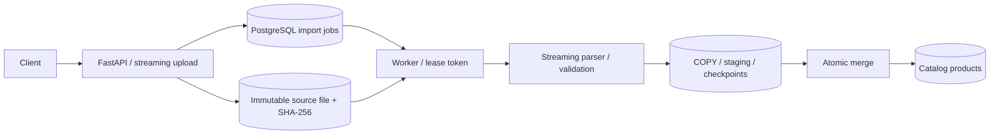

# 13. CatalogForge

**Потоковый импорт и очистка больших каталогов с продолжением после сбоя.**
Портфолио-проект уровня Middle+ Backend / Data Engineering, создан в сентябре 2026 года.

## Что реализовано

- JWT-аутентификация, каталоги с проверкой владельца, ключи идемпотентности импортов.
- Потоковая загрузка файла с SHA-256; CSV, JSON Lines и JSON-массивы.
- Сопоставление колонок, UTF-8, CSV с разделителями `,`, `;`, TAB и многострочными полями.
- Нормализация SKU/названий, проверка цены и остатка, отчёт по ошибкам строк.
- Дедупликация по SKU: последняя **валидная** строка файла побеждает.
- Пакеты через PostgreSQL COPY, долговременные staging-таблицы и контрольные точки.
- Lease/token для восстановления процесса без повторного учёта обработанных строк.
- Пауза, продолжение, отмена, режим проверки без изменения каталога.
- Атомарное применение всего импорта: каталог меняется одной транзакцией после проверки.
- Счётчики созданных, изменённых и неизменённых товаров; история операций.
- Очистка завершённых импортов с сохранением товаров, OpenAPI, метрики, Docker и CI.

## Быстрый запуск

```bash
cd ~/Desktop/Python-Backend-Portfolio/13-catalog-forge
docker compose up --build -d --wait --wait-timeout 180
docker compose exec -T api python scripts/smoke.py
```

Swagger: <http://localhost:8130/docs>.
Демонстрационный пользователь: `demo@example.com` / `CatalogForgeDemo123!`.
Пустой демо-каталог: `13000000-0000-0000-0000-000000000010`.

## API-сценарий

1. `POST /auth/register`, `POST /auth/login` — получить Bearer token.
2. `POST /catalogs` — создать каталог, либо `GET /catalogs` — выбрать свой.
3. `POST /imports` с `catalog_id`, `format`, настройками и `Idempotency-Key`.
4. `PUT /imports/{id}/file` — отправить **сам файл** как `application/octet-stream`,
   передав его SHA-256 в `X-Content-SHA256`.
5. `GET /imports/{id}` — статус, прогресс, ошибки, счётчики и измерение памяти.
6. `/errors`, `/preview`, `/events` — подробные отчёты.
7. `POST /imports/{id}/pause`, `/resume`, `/cancel` — управление обработкой.
8. `GET /catalogs/{id}/products` — товары, пагинация по `after_sku`.
9. `DELETE /imports/{id}` — удалить завершённый импорт, staging и исходник;
   товары каталога сохраняются.

Пример тела создания импорта:

```json
{
  "catalog_id": "13000000-0000-0000-0000-000000000010",
  "format": "csv",
  "column_map": {"sku": "Артикул", "name": "Название", "price": "Цена", "stock": "Остаток"},
  "delimiter": ";",
  "mode": "upsert",
  "error_policy": "skip"
}
```

`error_policy=skip` пропускает невалидные строки; `reject` отклоняет применение
всего импорта, если хотя бы одна строка невалидна. `mode=validate_only`
готовит отчёт и нормализованный preview, не изменяя каталог.

## Формат записей

```csv
sku,name,price,stock
item-001,Example product,12.50,7
item-002,Another product,4.00,0
```

JSON/JSONL используют те же поля. Для JSON нужен корневой массив объектов;
JSONL содержит по одному объекту на строку.

- SKU очищается от крайних пробелов, приводится к верхнему регистру и допускает
  латинские буквы, цифры, `_`, `.`, `-`; длина 1–80.
- Название очищается от повторных пробелов; длина 1–200 символов.
- Цена конечная, неотрицательная, до `999999999.99`, не более двух знаков после точки.
- Остаток — целое число от 0 до 1 000 000 000.
- Неизвестные поля не переносятся в товары. Отчёты ошибок не сохраняют сырые значения.

## Архитектура



Во время чтения файл не загружается целиком в память. Пакет, staging-данные,
ошибки и позиция чтения фиксируются согласованно. Каталог остаётся прежним
до успешного завершения финальной транзакции. Цена такой гарантии — место
для staging в PostgreSQL и транзакция применения, размер которой зависит
от числа уникальных товаров.

## Проверки

```bash
make check
make test
make smoke
# На хосте, из папки проекта:
uv run python scripts/recovery_smoke.py --rows 1000000
```

Recovery-сценарий загружает миллион товаров, убивает worker после сохранения
первого пакета и проверяет продолжение с той же контрольной точки. Дополнительно
в файле есть дубликат и ошибочная строка. Сценарий проверяет отсутствие
частично опубликованного каталога, точные счётчики и peak RSS worker < 256 MiB
на этом наборе данных. Перезапускается только worker данного проекта.

Подробности: [архитектура](docs/architecture.md), [эксплуатация](docs/runbook.md),
[фактические результаты](docs/verification.md), [объяснение на интервью](docs/interview.md).

## Настройки и границы

| Настройка | Значение по умолчанию |
|---|---|
| `BATCH_SIZE` | 2000 строк |
| `LEASE_SECONDS` | 15 секунд |
| `WORKER_INTERVAL` | 0.5 секунды |
| Размер исходного файла | до 256 MiB |
| Сохранённые примеры ошибок | первые 1000 строк; общий счётчик полный |
| Хранилище исходников | Docker volume `imports_data` |

CSV и JSONL продолжаются с байтовой позиции. JSON-массив повторно читается
потоковым парсером до сохранённого номера записи: память ограничена, но
повторное чтение префикса требует времени. Память зависит от размера пакета
и наибольшей записи. Во всех форматах запись ограничена 128 KiB; в JSON-массиве
проверка включает лишние поля и выполняется до сборки объекта. Тестовый порог
RSS относится к указанному синтетическому набору.
Оборванная HTTP-загрузка повторяется целиком; контрольные точки относятся
к обработке уже загруженного файла.

Импорты обновляют/добавляют товары; отсутствующие в файле SKU сохраняются.
При одновременных импортах одной компании итог определяется порядком commit.
Файлы и staging хранятся до удаления импорта. Рабочий образ не содержит pytest/Ruff.
Для демонстрации использован локальный volume; S3-коннектор не реализован.

Стек: Python 3.12, FastAPI, SQLAlchemy Core/asyncpg, PostgreSQL 17 COPY/UPSERT,
Pydantic, потоковый CSV/JSON-парсер, JWT/Argon2, Alembic, Docker Compose, pytest, Ruff.

## English

CatalogForge is a streaming catalog-import backend with durable batch checkpoints,
last-valid-row deduplication and atomic promotion into the published catalog.
Its PostgreSQL tests and a one-million-row worker-crash scenario verify recovery,
precise counters, ownership isolation and measured worker memory consumption.

## Исправления импорта — этап F

NUL в названии товара отклоняется как `invalid_name` до PostgreSQL COPY.
При `skip` корректные строки публикуются, при `reject` импорт завершается ошибкой,
а опубликованный каталог сохраняется. Невалидная строка больше не оставляет
задание в бесконечном повторе. Ошибки зависимости по-прежнему обрабатывает worker.

UTF-8 BOM удаляется только в абсолютном начале CSV/JSONL. U+FEFF внутри
многострочного поля или после checkpoint сохраняется; лимит логической записи
128 KiB остаётся действующим. [Проверка этапа F](docs/verification-stage-f.json):
57 тестов в отдельном тестовом образе с PostgreSQL, включая CSV/JSONL/JSON,
обе политики ошибок, terminal claim и следующее исправное задание.
